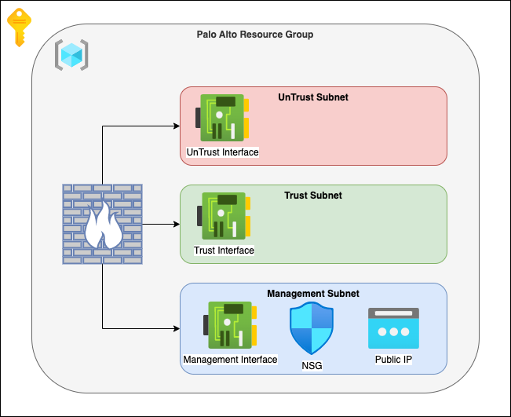

# Introduction

Guide on deploying a Palo Alto Firewall Virtual Appliance (NVA) on Azure and configure it using Terraform. Using infrastructure as code to automate the process on management and configuration of the network security infrastructure.



## Prerequisites

Before you begin, ensure that you have the following:

1. Access to an Azure subscription
   1. With Contributor Access - Deployment of resource group and accept marketplace agreements.
2. Basic knowledge of Terraform
3. PanSupport account (For production Deployments.)
   1. The deployment definition default License is BYOD

## Deployment Steps

### Azure Resources

Follow the steps below to deploy the Azure Resources:

1. Clone the GitHub repository
2. Change to the directory ```cd .\palo-deploy```
3. Initialize the Terraform environment - ```terraform init```
4. Modify the Terraform files to include your specific configuration settings.
5. Run ```terraform plan``` to validate the configuration.
6. If the configuration is valid, run the command ```terraform apply``` to create the resources in Azure.

### Palo Configuration

Follow the steps below to deploy the configuration for the firewall:

1. Change to the directory ```cd .\palo-config```
2. Initialize the Terraform environment - ```terraform init```
3. Modify the Terraform files to include your specific configuration settings.
4. Run ```terraform plan``` to validate the configuration.
5. If the configuration is valid, run the command ```terraform apply``` to configure the palo.
6. Login to the firewall portal with the public IP or Public IP DNS
   1. ```https://<PUBLIC_IP_MGT_NIC_DNS>.<AZURE_REGION>.cloudapp.azure.com/php/login.php```
   2. ```https://<PUBLIC_IP_MGT_NIC_IP>/php/login.php```
7. In the palo portal commit the changes terraform added

## Post-deployment Steps

After the deployment is complete, perform the following post-deployment steps:

1. Change the users password from the default
2. Create a service account for go forward configuration with terraform
3. Add Additional firewall policies and rules to the firewall.
4. Configure the management interface network security group to block all traffic except for allowed locations.
5. Configure the routing tables and virtual network gateways.
6. Test the connectivity and functionality of the firewall.

## Troubleshooting

### Test connectivity on interfaces

To test connectivity on each of the interfaces, login via SSH to the VM and use the ping command with the source IP of the nic.

```shell
## Ping for management interface
Ping host 8.8.8.8

## Ping for untrust interface
ping source <UnTurst_NIC_IP> host 8.8.8.8

## Ping for trust interface
ping source <Turst_NIC_IP> host 8.8.8.8
```

### azurerm_marketplace_agreement Out Of State

The marketplace agreement may have already been accepted causing terraform to error out. To get pass this import the object into the terraform state or comment out the object in the resource.standard.tf file.


